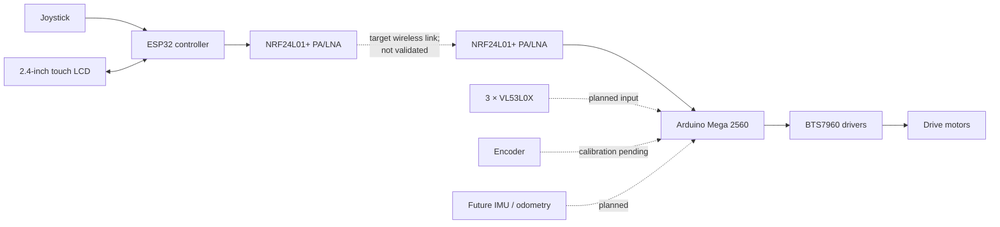

# Tracked Rover Prototype

An evidence-based engineering record for a modular tracked rover prototype used to validate motor drive, wireless manual control, feedback, sensing, and future navigation functions.

**Status date:** 30 September 2026  
**Current stage:** verified subsystem tests; integrated electronics test-bench work is next.

> [!IMPORTANT]
> Verified results apply only to the tested prototype and configurations documented here. The approximately 10 kg early-test load and 15° slope are targets, not measured performance. The approximately 200 kg payload concept is a future scale-up objective and is not a capability of this prototype.

<!-- Add docs/images/06_tracked_chassis.jpg here after a real photograph is available. -->

## Verified architecture

```mermaid
flowchart LR
    J[Analog joystick] --> N[Arduino Nano]
    N --> TX[Standard NRF24L01]
    TX -. 2.4 GHz wireless link .-> RX[Standard NRF24L01]
    RX --> M[Arduino Mega 2560]
    M --> B[BTS7960]
    B --> D[12 V DC worm-geared motor]
    E[20-slot optical encoder] -. pulse feedback only;<br/>RPM not validated .-> M
```

## Current prototype targets

- Approximately 25 × 25 cm tracked platform
- Two-motor differential drive
- Early load testing up to approximately 10 kg
- Target slope test of approximately 15°
- Battery-powered manual control, followed by sensing and feedback integration

These are development targets unless explicitly listed as verified below.

## Verified so far

- BTS7960 motor actuation and direction control
- Standard NRF24L01 bring-up after debugging
- Nano-to-Mega fixed-value and joystick-data reception
- Analog joystick characterization and neutral dead-zone definition
- Wireless joystick command to physical motor movement
- Encoder pulse detection (RPM accuracy is not verified)

## Currently being integrated

- Temporary controller-side and rover-side electronics test benches
- ESP32 controller transition; the recorded radio attempt stopped at a missing `RF24.h` compile error
- External-antenna NRF24L01+ PA/LNA modules; range is not validated
- 2.4-inch touch LCD
- Three VL53L0X time-of-flight sensors
- Encoder calibration before closed-loop speed control

## Target / Integration Architecture — Not Fully Validated



## Timeline

| Period | Milestone | Evidence status |
|---|---|---|
| 20 Aug 2026 | Initial BTS7960 motor test | Verified |
| 21 Aug 2026 | Standard NRF24L01 bring-up | Verified after debugging at module/communication-development level |
| 28–31 Aug 2026 | Joystick characterization | Verified |
| 31 Aug–3 Sep 2026 | Nano-to-Mega wireless link | Verified |
| 2–3 Sep 2026 | Wireless joystick-to-motor control | Verified |
| 3 Sep 2026 | Optical encoder integration | Partially verified; RPM readings invalid/unvalidated |
| Sep 2026 | ESP32 radio attempt, HMI layout, hardware upgrades | Attempted, acquired, or planned as documented |
| Late Sep 2026 | Temporary test-bench strategy | Implementation decision |

## Documentation

- [Development log](DEVELOPMENT_LOG.md)
- [Hardware inventory](HARDWARE.md)
- [Engineering roadmap](ROADMAP.md)
- [Test results matrix](tests/TEST_RESULTS.md)
- [Controller hardware notes](hardware/controller/README.md)
- [Rover hardware notes](hardware/rover/README.md)
- [Photo plan](docs/images/README.md)

<!-- Suggested future images: docs/images/03_controller_prototype.jpg and docs/images/08_rover_electronics_mockup.jpg -->
